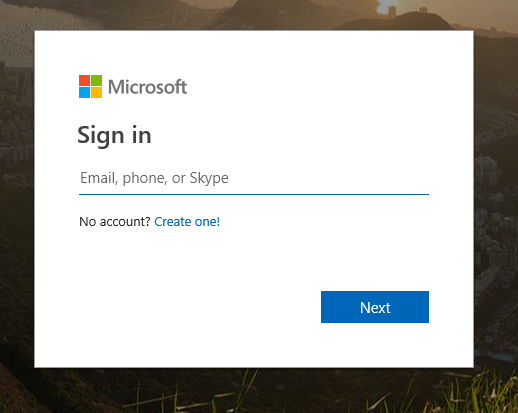
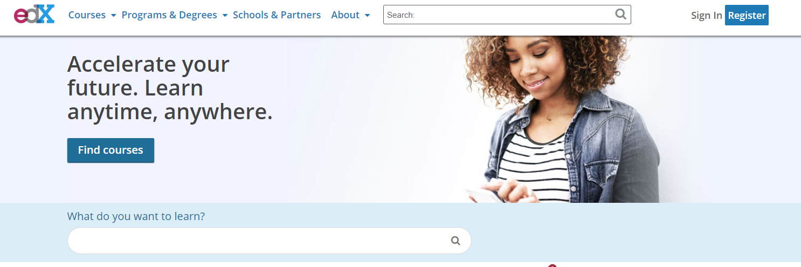
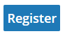
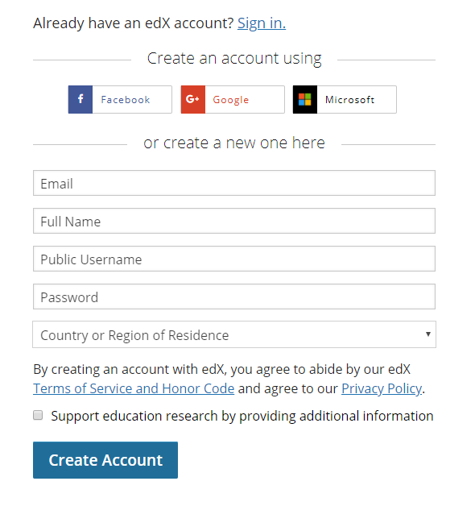
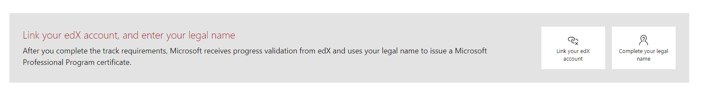
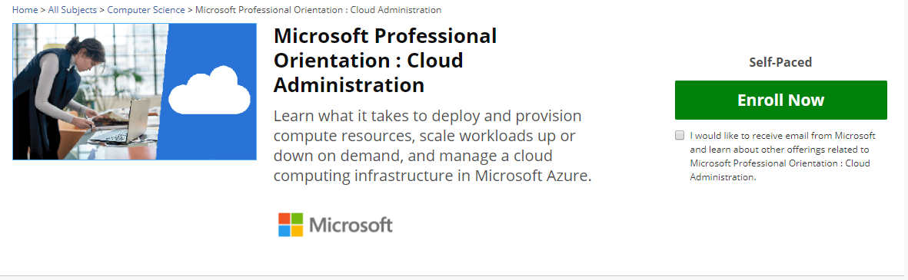

### Microsoft Academy

#### Overview

Link to Microsoft Academy: https://academy.microsoft.com

Microsoft provides training tracks in partnership with edX.org. edX.org are online self-paced courses on various topics.  For an easy to follow process, Microsoft has created tracks on https://academy.microsoft.com/
 
The eight (8) course tracks are:
 * [Cloud Administration](https://academy.microsoft.com/en-us/professional-program/tracks/cloud-administration/)
 * [Data Science](https://academy.microsoft.com/en-us/professional-program/tracks/data-science/) 
 * [Artificial Intelligence](https://academy.microsoft.com/en-us/professional-program/tracks/artificial-intelligence/)
 * [Big Data](https://academy.microsoft.com/en-us/professional-program/tracks/big-data/) 
 * [DevOps](https://academy.microsoft.com/en-us/professional-program/tracks/devops/)
 * [Front-End Web Development](https://academy.microsoft.com/en-us/professional-program/tracks/front-end-development/)
 * [Entry Level Software Development](https://academy.microsoft.com/en-us/professional-program/tracks/entry-level-software-development/)
 * [IT Support](https://academy.microsoft.com/en-us/professional-program/tracks/it-support/)
 
If you are looking for a place to start I would recommend Cloud Administration or DevOps if you have an Infrastructure or AppDev background, and Data Science or Big Data if you have a data background.
 
Most of these courses are developed by Microsoft. If Microsoft did not create the course but it is part of the track, then we have approved it.
 
Other Azure and Microsoft courses are available on edx.org. You will need a Microsoft account and an edX.org account to take these courses. In the next section we will walk through signing up for these accounts as well as getting started with your first course.
 
There are Microsoft Professional Program (MPP) Certificates tied to each track for a low cost.  All classes can be audited for free if the Certificate is not needed.  

 
#### Signing up for a Microsoft Account
 
Signing up for a Microsoft Account is simple and free. If you have a Microsoft Account, you can skip this section. A Microsoft Account is a Hotmail, Live, or Outlook account.
 
To get started head to https://academy.microsoft.com (Most Microsoft websites can be used to setup an account)
 
In the upper right-hand corner click "Sign In" Should look like this:

 
You will come to this page:

 
Click on "Create one!" 
 
Follow the instruction for creating a new account. Remember the username and password.

#### Signing up for an edX.org account
 
To sign up for an edX.org account open a browser and head to https://www.edx.org/
Find the "Register" button in the upper right-hand corner:

Look for this button and click on it:

 
You will come to this page:

With the Facebook, Google, or Microsoft accounts you will need to accept permissions for those accounts to access edX.org. The Microsoft accounts are work or school accounts not the outlook.com consumer account we created in the last section.
 
You will also need to create an edX.org username. This should not be your full email address. This username will be public on edX.org forums, certificates and linked accounts.
 

####  Linking accounts (Microsoft and edX)
 
Now that you have a Microsoft account and an edX account you need to link them, so you can track progress in the various courses.
 
  1.    Sign into https://academy.microsoft.com with your Microsoft personal account (Hotmail, Live, or Outlook).

          On the home screen you should this bar.
          

  2.    Click "Link your edX account"
  3.    Sign into edX with the email and password from the 'Sign up for edX' step. 
 
  4.    Click "Sign in"
      a.  Note: If you have not activated your edX account you may get this error screen. 
          1.  Leave this browser window open. 
          2. Open a new browser window. 
          3. Check your email that you signed up with and follow the activation instructions. 
          4. Close this browser window and go back to the edX sign-in page for academy.microsoft.com
  5.    Click "Allow" on the next screen. After which you will return to the Microsoft page.

#### Enrolling in a Track

Now that you have all the necessary accounts setup lets enroll in a track to begin our journey.
 
If are not already signed in academy.microsoft.com do so now.
 
Choose one of the eight (8) tracks to begin training. 
 1. [Cloud Administration](https://academy.microsoft.com/en-us/professional-program/tracks/cloud-administration/)
 2. [Data Science](https://academy.microsoft.com/en-us/professional-program/tracks/data-science/) 
 3. [Artificial Intelligence](https://academy.microsoft.com/en-us/professional-program/tracks/artificial-intelligence/)
 4. [Big Data](https://academy.microsoft.com/en-us/professional-program/tracks/big-data/) 
 5. [DevOps](https://academy.microsoft.com/en-us/professional-program/tracks/devops/)
 6. [Front-End Web Development](https://academy.microsoft.com/en-us/professional-program/tracks/front-end-development/)
 7. [Entry Level Software Development](https://academy.microsoft.com/en-us/professional-program/tracks/entry-level-software-development/)
 8. [IT Support](https://academy.microsoft.com/en-us/professional-program/tracks/it-support/)
 
For the rest of this demo we will focus on "Cloud Administration". The other tracks follow the same pattern. 
 
  1. Find the track you wish to enroll in. Click the "Enroll now" button

        

  2. You should see a screen like this based on the track you chose.

        
  
  3. Click the "view track details" on the track card

        

  4. You should now see list of the required to complete this track. Courses do not have to be completed in order. Click "Get Started" on the first course.

        
        

  5. Click "Ok" on the "Go to course" screen

        

  6. Select "Enroll Now" on the course home page

        

  7. Choose the course experience. The course and materials are the same for both. The only difference is the Certificate at the end of the course and at the end of the track.

        

  8. Congratulations, you have enrolled in your first course. A few items of note for each course:
      a. Each course does have a time limit. Most course provide two (2) months to complete. Read the instructions to see if the time limits change for each course.
      b. https://support.edx.org is a great place for visit if you are brand new to online courses.
      c. There is a mobile app for edX. It is very useful for watching and reading content offline.
 
### Good Luck and Enjoy!!!

