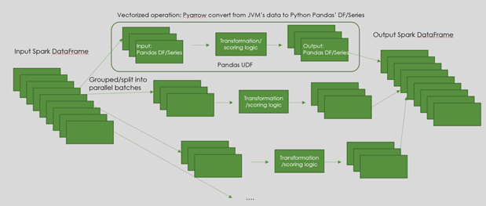
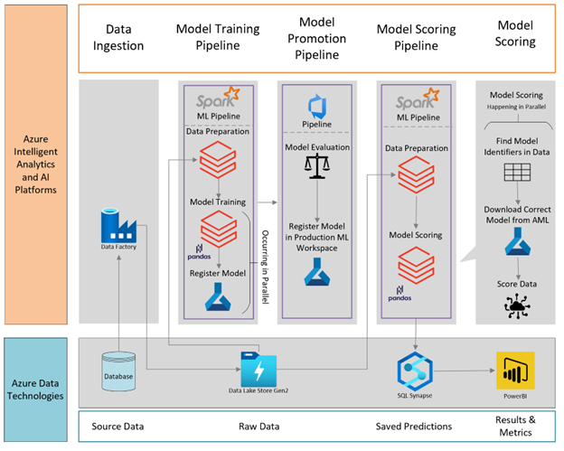
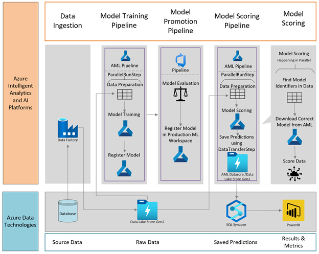

# Implement many models for ML in Azure 

There are many scenarios where we need to build and run a large number of machine learning models. For examples: in Retail where a separate revenue forecast model is needed for each store and brand, in Supply Chain where Inventory Optimization is done for each warehouse and product, in Restaurant where demand forecasting models are needed across thousands of restaurants etc. This pattern is commonly referred to as Many Models. While Azure ML Platform team has published a popular [accelerator](https://github.com/microsoft/solution-accelerator-many-models/blob/master/Custom_Script/scripts/timeseries_utilities.py) using Azure Parallel Run Step (PRS) and AutoML, I’d like to expand it further with additional options to simplify the implementation and address more business technology scenarios such as option of using Spark in Databricks and Synapse or with AML PRS but with tabular data instead of file dataset.

## Option 1: [Implementing Many Models using Spark 3.x in Azure Synapse Spark or Azure Databricks](./code/spark/many_models_spark.ipynb)
Spark is very powerful for complex big data transformation. Customers who need Many Models probably have Spark applications in place. The ability to split or group a large dataset into/by multiple partitions for parallel processing is a valuable feature. This capability in Spark versions earlier than 3.0 however was very limited with Spark APIs for generic transformation. However, since 3.0, Spark has added much better support for Python & Pandas. With ability in Azure Cloud to install Python & ML packages, Spark can be very powerful option to implement Many Models. 

The advantage of using Spark for Many Models is Spark can provide flexible splitting or grouping logics to group data by entities (such as combination of product-store, location-product…) for Many Models training/inferencing, and then can easily collect result in the form of Spark Data Frame for next steps.  
###                   Architecture using Spark  

1.	Data Ingestion
a.	Data is pulled from the source data and copied to Azure Data Lake Gen2.
2.	Model Training Pipeline
a.	Data Preparation: Data is pulled from Azure Data Lake Gen2 and grouped by product, location, time, etc. The dimensions of these groups will create the training dataset for each of the models.
b.	Model Training: Each dataset formed from the data preparation step will train a model. Using Pandas Function API, training can be done in parallel for multiple groups of data. Once training has completed for the model, it is then registered into Azure Machine Learning along with the testing metrics.
3.	Model Promotion Pipeline
a.	Model Evaluation: After training, newly produced models need to be evaluated before moving to production. Using a DevOps pipeline, business logic is applied to determine if a model meets the criteria for deployment, an example is that the accuracy on the testing data was over 80%. 
b.	If the model qualifies, then it is registered to the production Azure Machine Learning Workspace.
4.	Model Scoring Pipeline
a.	Data Preparation: Data is pulled from Azure Data Lake Gen2 and grouped the same dimensions that were used for training. 
b.	Model Scoring: Using the Pandas Function API to run score multiple datasets at once, the dimensions are determined for each dataset and used to find the appropriate model in AML by searching the tags. Models are then downloaded and used to score. Results is then persisted using Spark connector to SQL Synapse for serving.
5.	Results
a.	Predictions: predictions are saved to SQL Synapse during the model scoring pipeline.
b.	Metrics: PowerBI connects to the model predictions to retrieve and aggregate results for end user.

## Option 2: [Implementing Many Models using Azure ML Parallel Run Step and Azure ML Pipeline](./code/aml_prs/prs_many_models.ipynb)

Azure Parallel Run Step (PRS) is a powerful option to run any sort of ML Many Models training and inferencing. Given an input dataset (file or tabular), PRS can split data by number of files (for file dataset) or partition data by size or by a column value (tabular dataset) then apply your ML script which can be any ML algorithm on thousands of portions/partitions in parallel. Like other forms of AML training, you can specify your custom training environment with libraries dependencies or more advanced with custom docker environment for configurations beyond standard PyPi libraries and wide choices of CPU and GPUs machines.

The Many Models accelerator provides detail guideline with file dataset. This requires data to be in the form of multiple files with each file to be the data for a model (e.g. store-brand transaction data). Data in your environment may come from a centralized source (e.g. a big dataset for all products, stores…) so you would need to prepare data into such file dataset format which may not be convenient.

## When to use Synapse Spark/Databricks for Many Models
•	When your Many Model training pipeline has complex data transformation & grouping requirements before data can be used for ML training, that Spark itself is a natural fit. Then it can be a good extension to write Many Model step using Spark Pandas Function API.
•	When your ML training and scoring algorithms are straight forward common libraries such as Sklearn on tabular data. This doesn’t require you to deal with complex library installation, data dependencies, custom OS level configuration which Synapse or even Databricks users may have hard time to configure
## When to use Azure ML PRS and pipeline
•	When your data is already separated by entities that you models are supposed to trained for. For example, data for each model is already in a separate file or for tabular data, the partition column(s) already exist in the dataset. This means that you don’t need to use Spark for complex data transformation.
•	When you are doing types of ML that requires complex environment setup for example custom docker, downloading of data files and pretrained models… Azure ML environment and compute provide great flexibility to do all these. Computer Vision, NLP Deep Learning are examples for these scenarios.
## Performance and Scalability 
-	The key part about Many Models is to prepare data in the form of multiple partitions, each partition contains data for a model in both training and inferencing. For example, a partition might be a combination of product and store.  Depending on the source data format, it may be easy to get data to this form or it may require extensive data shuffling and transformation. You will need to select suitable technology to do this job. For example, Spark or SQL Synapse can be very scalable with complex data partitioning, shuffling and grouping on large volume of data while Python Pandas has limited scalability as it runs only on one node and process.
-	Apart from the data preparation process, training can be very scalable in both Spark and PRS. You can train hundreds thousands of models in parallel.
-	Both Spark and PRS spin up separate training processes in every machine in a cluster and you can spin up a process for each core in a machine. While this means very good utilization of resources, It is important to size the cluster and the right SKU especially if the training process is expensive and long running

The two approaches share same [util file](./code/util/timeseries_utilities.py) which is copied from [Many Model Accelerator repo](https://github.com/microsoft/solution-accelerator-many-models/blob/master/Custom_Script/scripts/timeseries_utilities.py)